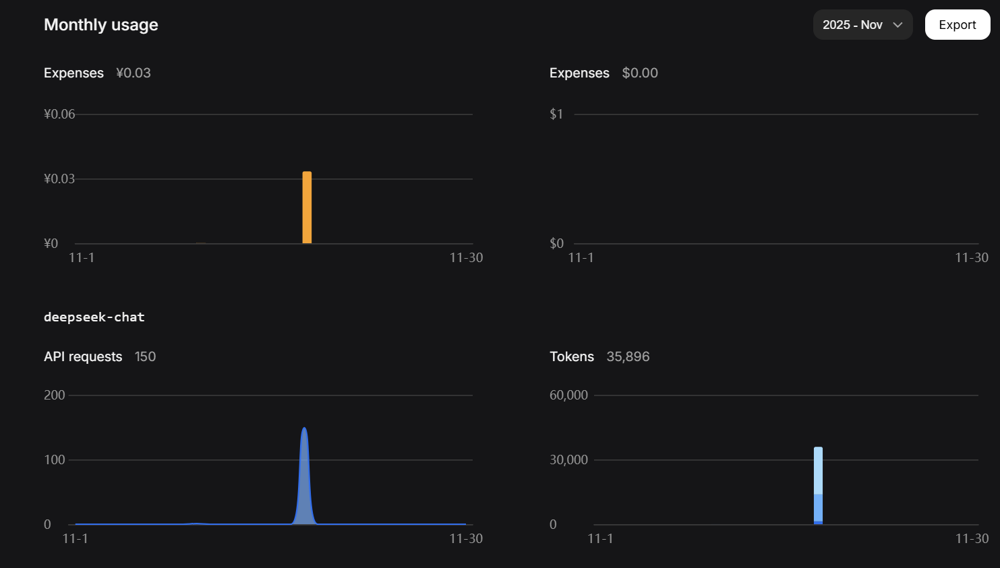
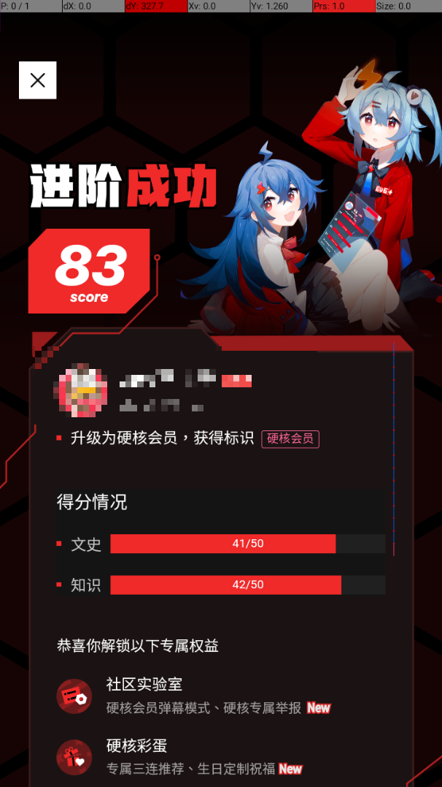

# bilibili_senior_llm（b站硬核会员考试llm自动答题）

一个用于在安卓设备上自动获取题目并答题的智能机器人。支持真机和所有模拟器（BlueStacks、夜神、MuMu等）。

## 快速开始

### 1. 安装依赖

```bash
pip install "paddlepaddle>=3.0.0" "paddleocr>=3.0.0" openai pillow numpy pygetwindow pywin32
```

### 2. 配置文件

编辑 `config.yaml`，设置你的 API Key：

```yaml
# LLM 配置
llm:
  model: deepseek-chat
  api_key: your-api-key-here  # 替换为你的 API Key
  base_url: https://api.deepseek.com/v1

# 控制器模式（推荐使用 ADB）
controller:
  type: adb  # 或 bluestacks

# ADB 配置（推荐）
adb:
  auto_setup: true  # 自动下载 ADB、检测设备、选择设备
  device_id: null   # 留空自动检测，或指定设备 ID

# 其他配置
crop_ratios: [0.0, 0.2, 1.0, 0.7]  # 截图裁剪比例
merge_threshold: 30                 # OCR 文本框合并阈值
click_delay: 2.0                    # 点击延迟（秒）
debug_mode: false                   # 调试模式，保存OCR结果
```

> ✅理论上配置了apikey+模拟器开启adb调试，就可以了

### 3. 运行程序

```bash
python main.py
```

首次使用 ADB 模式时，程序会自动：

- 检测或下载 ADB 工具
- 检测已连接的设备/模拟器
- 自动选择设备（单设备）或提示选择（多设备）

## 配置说明

### 控制器模式

**ADB 模式**（推荐）

- 支持真机和所有模拟器
- 自动管理 ADB 工具
- 更稳定可靠

~~**BlueStacks 模式（可能不支持了）**~~

### 常用配置项

| 配置项 | 说明 | 默认值 |
|--------|------|--------|
| `llm.api_key` | LLM API 密钥 | 必填 |
| `controller.type` | 控制器类型 | `adb` |
| `adb.auto_setup` | 自动设置 ADB | `true` |
| `crop_ratios` | 截图裁剪比例 | `[0.0, 0.2, 1.0, 0.7]` |
| `click_delay` | 点击延迟（秒） | `2.0` |
| `debug_mode` | 保存调试截图 | `false` |

## 截图

调试+运行100个问题，大概花费3分钱



选择`文史`+`知识`内容，得分情况：




## Star History

[](https://www.star-history.com/#JavaZeroo/bilibili_senior_llm&type=date&legend=top-left)

## 许可证

MIT License - 详见 [LICENSE](LICENSE) 文件。
